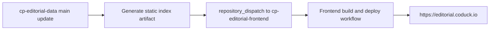

# ARCHITECTURE

## 1. Goals

`cp-editorial-frontend` is a React + Vite + TypeScript web app for searching and browsing competitive-programming editorials.

Core goals:

1. Discover editorials via search and category flows.
2. Support internationalized UI (English, Korean, Japanese initially).
3. Consume editorial metadata from `cp-editorial-data`.
4. Support Unicode editorial filenames safely.
5. Automatically deploy to `https://editorial.coduck.io` when editorial data is updated.
6. Support user-selectable light/dark theme with persisted preference.

## 2. System context



- **Data source**: `cp-editorial-data`
- **Frontend repo**: `cp-editorial-frontend`
- **Runtime consumption**: static index JSON (`/public/data/editorial-index.json` or published artifact equivalent)
- **Deployment target**: custom domain `editorial.coduck.io`

## 3. Frontend module architecture

```text
src/
  app/
    App.tsx
    providers/
    routes/
  pages/
    Home, Search, Categories, Category, CategoryContest, EditorialDetail, Contribute
  entities/
    editorial/model/
      types.ts
      normalize.ts
  shared/
    api/
    hooks/
    i18n/
    ui/
```

### Responsibilities

- `app/`: app-level composition, providers, routing.
- `pages/`: route-level UI and feature orchestration.
- `entities/editorial/model/`: typed domain model and normalization.
- `shared/api/`: data access boundary (editorial index fetch).
- `shared/hooks/`: reusable data hooks.
- `shared/i18n/`: translations and i18n utilities.
- `shared/ui/`: layout and reusable UI components.

## 4. Data contract and normalization

The frontend consumes a static index with this shape:

```json
{
  "version": "2026.04.17",
  "generatedAt": "2026-04-17T00:00:00Z",
  "editorials": [
    {
      "contest": "중앙대학교",
      "problem": "2026 중앙대학교 프로그래밍 경진대회 (CPC)",
      "categories": ["University"],
      "path": "University/중앙대학교/2026 중앙대학교 프로그래밍 경진대회 (CPC).pdf",
      "filename": "2026 중앙대학교 프로그래밍 경진대회 (CPC).pdf",
      "title": {
        "en": "2026 중앙대학교 프로그래밍 경진대회 (CPC)",
        "ko": "2026 중앙대학교 프로그래밍 경진대회 (CPC)",
        "ja": "2026 중앙대학교 프로그래밍 경진대회 (CPC)"
      },
      "summary": {
        "en": "중앙대학교 editorial",
        "ko": "중앙대학교 해설",
        "ja": "중앙대학교 解説"
      }
    }
  ]
}
```

### Filename policy

- `filename` may use any language/script.
- Unicode filenames are accepted.

### Path mapping policy

- First path segment is treated as **category**.
- Second path segment is treated as **contest name / organizer**.
- File stem is treated as **contest entry title**.
- Examples:
  - `Olympiad/Russian Olympiad in Informatics/Russia Team High School Programming Contest 2020.pdf`
    - category: `Olympiad`
    - contest: `Russian Olympiad in Informatics`
    - entry title: `Russia Team High School Programming Contest 2020`

### Exclusion policy

- Index generation supports explicit excludes via `scripts/editorial-index.config.json`:
  - `excludeFileNames`
  - `excludePathPrefixes`
  - `excludePathPatterns`
- Current defaults exclude repository-management content such as `README.md`, `LICENSE`, and the `.github/` folder.

### Stable ID policy

- Routing must not depend on filename language.
- Editorial IDs are derived from stable fields (`contest`, `problem`, `path`) when explicit `id` is not provided.
- This prevents link breakage if filename language changes.

### Validation policy

Normalization rejects invalid index data (missing required fields or empty localized title content) with explicit errors.

## 5. Routing model

| Route                                     | Purpose                                                              |
| ----------------------------------------- | -------------------------------------------------------------------- |
| `/`                                       | Home summary, index stats, and “What is CP Editorial?” article       |
| `/search`                                 | Keyword search grouped by category + contest, then editorial entries |
| `/categories`                             | Category listing                                                     |
| `/categories/:category`                   | Contest listing within a category                                    |
| `/categories/:category/contests/:contest` | Editorial listing within a selected contest                          |
| `/editorials/:editorialId`                | Editorial detail page                                                |
| `/contribute`                             | Upload/contribution guide for `cp-editorial-data`                    |

## 6. Internationalization

- Framework: `i18next` + `react-i18next`
- Locales: `en`, `ko`, `ja`
- UI language is switchable at runtime.
- Editorial localized fields are resolved with fallback order:
  1. active locale
  2. `en`
  3. `ko`
  4. `ja`
  5. first available value

## 7. UI preferences

- Theme supports `light` and `dark`.
- Active theme is selected in the header and persisted in browser local storage.
- Theme is applied at the document root via `data-theme`, so all routed pages share one consistent palette.

## 8. Upload guidance flow

The website includes a dedicated `/contribute` page with instructions:

1. Add files in `Category/Contest(or Organization)/Editorial file` hierarchy.
2. Use clear filenames because the filename stem becomes the displayed editorial entry title.
3. Keep only editorial source files in target folders (non-editorial files are excluded by config).
4. Merge PR to `main` to trigger index regeneration + frontend deployment.

## 9. CI quality architecture

`ci.yml` enforces:

1. Formatting check (`npm run format:check`)
2. Lint (`npm run lint`)
3. Static analysis/type-check (`npm run analyze`)
4. Build (`npm run build`)

Runs on pull requests and pushes to `main`.

`sonarcloud.yml` adds code-quality scanning on pull requests and pushes to `main`:

1. Validates SonarCloud repository configuration (`SONAR_TOKEN`, `SONAR_ORGANIZATION`, `SONAR_PROJECT_KEY`)
2. Runs SonarCloud scan with repository-level settings from `sonar-project.properties`
3. Enforces merge-blocking quality gate status through the SonarCloud quality gate action

Dependabot PRs are also validated by the CI workflow, and dependency updates are managed via `.github/dependabot.yml`.

## 10. Deployment architecture

### Trigger policy

- Frontend deploy runs on:
  - push to `main` in `cp-editorial-frontend`
  - `repository_dispatch` event from `cp-editorial-data` updates
  - manual `workflow_dispatch`

### Deployment target

- GitHub Pages deployment with custom domain:
  - `public/CNAME` contains `editorial.coduck.io`
  - deployment serves `https://editorial.coduck.io`

### Update behavior

On `cp-editorial-data` main updates:

1. Data repo sends dispatch event to frontend repo.
2. Frontend runs `npm run index:generate` to fetch full file tree from `cp-editorial-data` and regenerate static index.
3. Frontend rebuilds with latest index.
4. Updated site is published to `https://editorial.coduck.io`.

## 11. Future extensions

- Incremental index partitions for very large editorial sets.
- Full-text search index generation in data pipeline.
- Runtime stale-while-revalidate index refresh strategy.
- Additional locale packs and translated metadata quality checks.
